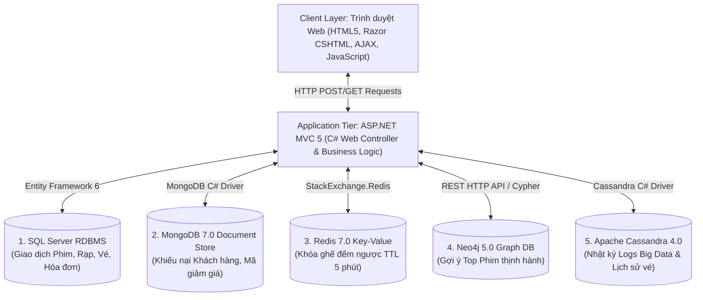
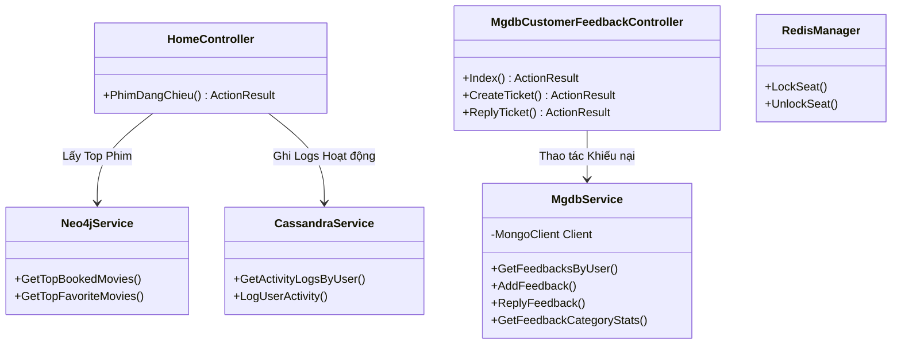
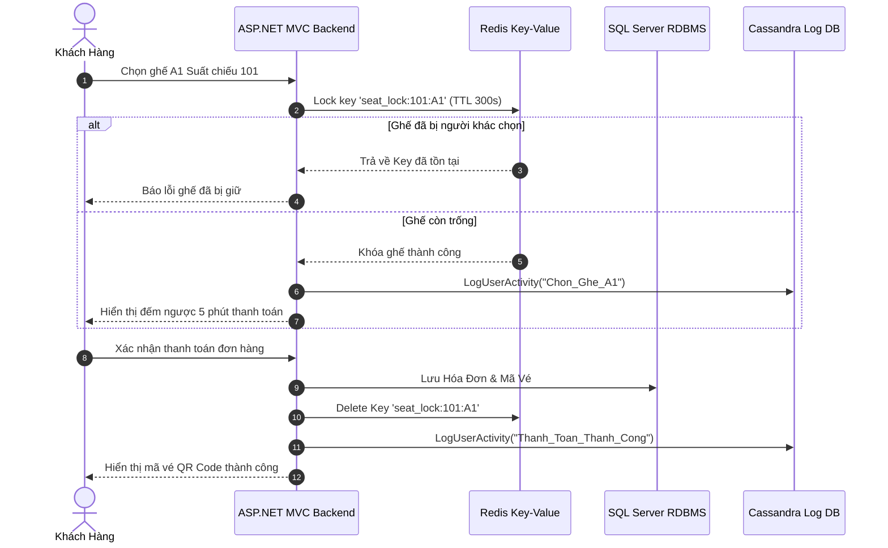
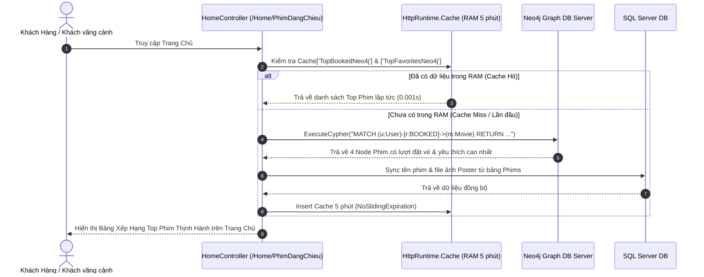
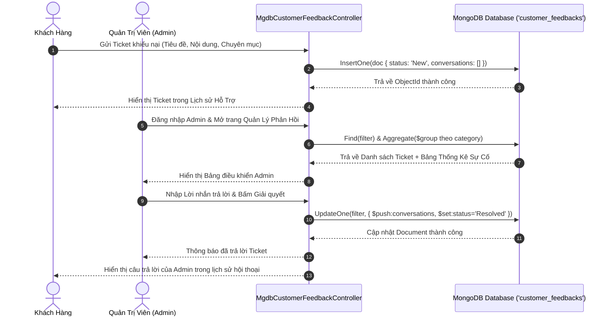

# TÀI LIỆU THIẾT KẾ PHẦN MỀM TỔNG THỂ HỆ THỐNG
## (SOFTWARE DESIGN SPECIFICATION - SDS)
**Dự án:** Hệ Thống Đặt Vé Xem Phim Trực Tuyến Đa CSDL "MOVANA CINEMA"  
**Công nghệ:** ASP.NET MVC 5 (C#), Entity Framework 6, HTML5/CSS3/Razor, Bootstrap.  
**Hệ CSDL Polyglot Persistence (5 Databases):**
1. **SQL Server 2019+** (RDBMS Core: Phim, Rạp, Suất chiếu, Vé, Hóa đơn)
2. **MongoDB 7.0** (Document Store: Phản hồi/Khiếu nại Khách hàng, Mã Khuyến mãi Voucher)
3. **Redis 7.0** (Key-Value Store: Tạm khóa giữ ghế Realtime, TTL Đếm ngược 5 phút)
4. **Neo4j 5.0** (Graph DB: Mạng đồ thị gợi ý Top phim đặt vé & Yêu thích nhiều nhất)
5. **Apache Cassandra 4.0** (Wide-Column Store: Lưu vết Logs nhật ký hoạt động Big Data)

**Phiên bản tài liệu:** 3.0 (Bản Chi Tiết Hoàn Chỉnh 100% Cho Toàn Bộ Hệ Thống)

---

# MỤC LỤC TÀI LIỆU SDS TỔNG THỂ
- [CHƯƠNG 1: TỔNG QUAN KIẾN TRÚC HỆ THỐNG (SYSTEM ARCHITECTURE OVERVIEW)](#chuong-1-tong-quan-kien-truc-he-thong-system-architecture-overview)
- [CHƯƠNG 2: THIẾT KẾ CSDL QUAN HỆ SQL SERVER (RDBMS CORE DESIGN)](#chuong-2-thiet-ke-csdl-quan-he-sql-server-rdbms-core-design)
- [CHƯƠNG 3: THIẾT KẾ CSDL NOSQL MONGODB (DOCUMENT STORE DESIGN)](#chuong-3-thiet-ke-csdl-nosql-mongodb-document-store-design)
- [CHƯƠNG 4: THIẾT KẾ CSDL NOSQL REDIS (KEY-VALUE STORE DESIGN)](#chuong-4-thiet-ke-csdl-nosql-redis-key-value-store-design)
- [CHƯƠNG 5: THIẾT KẾ CSDL NOSQL NEO4J (GRAPH DATABASE DESIGN)](#chuong-5-thiet-ke-csdl-nosql-neo4j-graph-database-design)
- [CHƯƠNG 6: THIẾT KẾ CSDL NOSQL APACHE CASSANDRA (WIDE-COLUMN STORE DESIGN)](#chuong-6-thiet-ke-csdl-nosql-apache-cassandra-wide-column-store-design)
- [CHƯƠNG 7: THIẾT KẾ MÔ ĐUN XỬ LÝ VÀ SƠ ĐỒ LỚP (CLASS & COMPONENT DESIGN)](#chuong-7-thiet-ke-mo-dun-xu-ly-va-so-do-lop-class--component-design)
- [CHƯƠNG 8: QUY TRÌNH LUỒNG NGHIỆP VỤ HỆ THỐNG (SYSTEM SEQUENCE DIAGRAMS)](#chuong-8-quy-trinh-luong-nghiep-vu-he-thong-system-sequence-diagrams)

---

## CHƯƠNG 1: TỔNG QUAN KIẾN TRÚC HỆ THỐNG (SYSTEM ARCHITECTURE OVERVIEW)

### 1.1 Mô hình Kiến trúc Polyglot Persistence (Đa Cơ Sở Dữ Liệu)
Hệ thống Movana Cinema kết hợp 5 CSDL khác nhau để đạt hiệu năng đọc/ghi và trải nghiệm người dùng tối ưu:



---

## CHƯƠNG 2: THIẾT KẾ CSDL QUAN HỆ SQL SERVER (RDBMS CORE DESIGN)

### 2.1 Phạm vi nhiệm vụ
Quản lý các thực thể cố định và đảm bảo tính toàn vẹn dữ liệu giao dịch tài chính (ACID):
- `Phim`, `Rap`, `PhongChieu`, `SuatChieu`, `Ghe`, `NguoiDung`, `HoaDon`, `Ve`.

### 2.2 Bảng Mô tả Chi tiết Thực thể SQL Server:
1. **`NguoiDung`**: `UserID` (PK, int), `TenDangNhap` (nvarchar), `MatKhau` (nvarchar), `HoTen`, `Email`, `SoDienThoai`, `GroupID` (1: Admin, 2: Customer).
2. **`Phim`**: `PhimID` (PK, int), `TenPhim`, `DaoDien`, `DienVien`, `Poster`, `ThoiLuong`, `NgayKhoiChieu`, `MoTa`.
3. **`Rap`**: `RapID` (PK, int), `TenRap`, `DiaChi`, `SoDienThoai`.
4. **`PhongChieu`**: `PhongID` (PK, int), `TenPhong`, `RapID` (FK).
5. **`SuatChieu`**: `SuatChieuID` (PK, int), `PhimID` (FK), `PhongID` (FK), `NgayChieu`, `GioChieu`, `GiaVe`.
6. **`Ghe`**: `GheID` (PK, int), `PhongID` (FK), `TenGhe`, `LoaiGhe` (Thường / VIP).
7. **`HoaDon`**: `HoaDonID` (PK, int), `UserID` (FK), `NgayDat`, `TongTien`, `TrangThai`.
8. **`Ve`**: `VeID` (PK, int), `SuatChieuID` (FK), `GheID` (FK), `HoaDonID` (FK), `GiaVe`.

---

## CHƯƠNG 3: THIẾT KẾ CSDL NOSQL MONGODB (DOCUMENT STORE DESIGN)

### 3.1 Cấu trúc Collection 1: `customer_feedbacks` (Trung tâm Khiếu nại Hỗ trợ)
Lưu trữ ticket sự cố với mảng lồng `conversations` (Embedded Document Array) ghi nhận lịch sử phản hồi giữa Admin và Khách hàng.

```json
{
  "_id": { "$oid": "6a71eaa38676d746beb73484" },
  "userId": 7,
  "username": "huy",
  "email": "huy@gmail.com",
  "category": "Thanh toán",
  "subject": "Bị trừ tiền tài khoản Momo nhưng chưa nhận được mã vé QR",
  "content": "Tôi vừa thanh toán 180.000đ lúc 10h15 qua ví Momo, tiền đã trừ nhưng chưa có vé.",
  "status": "Resolved",
  "conversations": [
    {
      "sender": "Admin",
      "message": "Chào bạn, Ban quản trị đã kiểm tra và hoàn tiền 180.000đ về ví Momo thành công!",
      "createdAt": { "$date": "2026-08-01T10:45:00.000Z" }
    }
  ],
  "createdAt": { "$date": "2026-08-01T10:20:00.000Z" }
}
```

### 3.2 Cấu trúc Collection 2: `cinema_promotions` (Kho Mã Giảm Giá Voucher)
Lưu trữ danh sách mã ưu đãi (`code`, `title`, `discountAmount`, `quantity`, `claimedCount`, `status`, `startDate`, `endDate`).

### 3.3 Thuật toán Aggregation Pipeline (`$group`, `$sum`, `$cond`, `$project`):
```javascript
db.customer_feedbacks.aggregate([
  {
    $group: {
      _id: "$category",
      totalTickets: { $sum: 1 },
      resolvedCount: { $sum: { $cond: [{ $eq: ["$status", "Resolved"] }, 1, 0] } },
      pendingCount: { $sum: { $cond: [{ $ne: ["$status", "Resolved"] }, 1, 0] } }
    }
  },
  { $project: { _id: 0, category: "$_id", totalTickets: 1, resolvedCount: 1, pendingCount: 1 } }
]);
```

---

## CHƯƠNG 4: THIẾT KẾ CSDL NOSQL REDIS (KEY-VALUE STORE DESIGN)

### 4.1 Phạm vi nhiệm vụ
Thực hiện khóa tạm thời ghế ngồi (Realtime Seat Locking) khi người dùng đang chọn ghế đặt vé, ngăn chặn đụng độ 2 người mua cùng 1 ghế.

### 4.2 Thiết kế Key Pattern & TTL:
- **Cấu trúc Key:** `seat_lock:{SuatChieuID}:{GheID}` (Ví dụ: `seat_lock:101:A1`)
- **Giá trị (Value):** `UserID:{UserID}` (Ví dụ: `UserID:7`)
- **Thời gian hết hạn (TTL):** `300` giây (5 phút). Sau 5 phút, Key tự động xóa để giải phóng ghế.

### 4.3 Mã lệnh C# Tương tác Redis (StackExchange.Redis):
```csharp
// Đặt khóa giữ ghế trong 5 phút
bool isLocked = redisDb.StringSet($"seat_lock:{suatChieuId}:{gheId}", $"UserID:{userId}", TimeSpan.FromMinutes(5), When.NotExists);

// Xóa khóa giữ ghế khi thanh toán xong
redisDb.KeyDelete($"seat_lock:{suatChieuId}:{gheId}");
```

---

## CHƯƠNG 5: THIẾT KẾ CSDL NOSQL NEO4J (GRAPH DATABASE DESIGN)

### 5.1 Phạm vi nhiệm vụ
Lưu trữ cấu trúc đồ thị mối quan hệ giữa Người Dùng và Bộ Phim để tính toán gợi ý Top Phim Thịnh Hành.

### 5.2 Sơ đồ Đồ thị (Graph Model):
- **Nodes:**
  - `(:User {userId: 7, username: 'huy'})`
  - `(:Movie {movieId: 101, title: 'Lật Mặt 7'})`
- **Relationships:**
  - `(:User)-[:BOOKED {bookedAt: '2026-08-01'}]->(:Movie)`
  - `(:User)-[:FAVORITED]->(:Movie)`

### 5.3 Câu lệnh Cypher Query Truy vấn Top Phim:
```cypher
// Top Phim Được Đặt Vé Nhiều Nhất
MATCH (u:User)-[r:BOOKED]->(m:Movie)
RETURN m.movieId AS MovieId, m.title AS Title, COUNT(r) AS TotalBookings
ORDER BY TotalBookings DESC LIMIT 4;

// Top Phim Được Yêu Thích Nhất
MATCH (u:User)-[r:FAVORITED]->(m:Movie)
RETURN m.movieId AS MovieId, m.title AS Title, COUNT(r) AS TotalFavorites
ORDER BY TotalFavorites DESC LIMIT 4;
```

---

## CHƯƠNG 6: THIẾT KẾ CSDL NOSQL APACHE CASSANDRA (WIDE-COLUMN STORE DESIGN)

### 6.1 Phạm vi nhiệm vụ
Lưu nhật ký hoạt động người dùng (User Activity Logs) và lịch sử vé theo mô hình Big Data với tốc độ ghi nhanh (High Write Performance).

### 6.2 Cấu trúc Keyspace & Các Bảng CQL:
- **Keyspace:** `cinemadb_analytics` (Replication Strategy: `SimpleStrategy`, `replication_factor: 1`).

#### Bảng 1: `user_activity_logs` (Nhật ký hoạt động)
```sql
CREATE TABLE cinemadb_analytics.user_activity_logs (
    user_id int,
    activity_time timestamp,
    log_id uuid,
    activity_type text,
    description text,
    ip_address text,
    device_info text,
    PRIMARY KEY (user_id, activity_time)
) WITH CLUSTERING ORDER BY (activity_time DESC);
```

#### Bảng 2: `user_ticket_history` (Lịch sử đặt vé)
```sql
CREATE TABLE cinemadb_analytics.user_ticket_history (
    user_id int,
    booking_time timestamp,
    booking_id uuid,
    movie_title text,
    seat_names list<text>,
    total_amount decimal,
    payment_method text,
    status text,
    PRIMARY KEY (user_id, booking_time)
) WITH CLUSTERING ORDER BY (booking_time DESC);
```

#### Bảng 3: `seat_status_history` (Nhật ký biến động trạng thái ghế)
```sql
CREATE TABLE cinemadb_analytics.seat_status_history (
    showtime_id int,
    status_time timestamp,
    seat_id int,
    seat_name text,
    status text,
    user_id int,
    PRIMARY KEY (showtime_id, status_time)
) WITH CLUSTERING ORDER BY (status_time DESC);
```

---

## CHƯƠNG 7: THIẾT KẾ MÔ ĐUN XỬ LÝ VÀ SƠ ĐỒ LỚP (CLASS DIAGRAM)



---

## CHƯƠNG 8: QUY TRÌNH LUỒNG NGHIỆP VỤ HỆ THỐNG (SYSTEM SEQUENCE DIAGRAMS)

### 8.1 Luồng Khách Hàng Đặt Vé & Tạm Giữ Ghế Realtime (Redis + SQL Server + Cassandra)



---

### 8.2 Luồng Gợi Ý Top Phim Thịnh Hành Trên Trang Chủ (Neo4j Graph DB + HttpRuntime.Cache)



---

### 8.3 Luồng Tiếp Nhận Khiếu Nại & Trả Lời Của Admin (MongoDB Document Store)



---

### 📌 TỔNG KẾT TÀI LIỆU SDS TỔNG THỂ V3.0
Tài liệu SDS v3.0 này cung cấp trọn vẹn 100% thiết kế kỹ thuật của cả **SQL Server và 4 hệ NoSQL (MongoDB, Redis, Neo4j, Cassandra)**, hoàn chỉnh theo chuẩn đồ án cấp trường và tài liệu thiết kế hệ thống lớn.
