# TÀI LIỆU THIẾT KẾ PHẦN MỀM TỔNG THỂ HỆ THỐNG
## (SOFTWARE DESIGN SPECIFICATION - SDS)
**Dự án:** Hệ Thống Đặt Vé Xem Phim Trực Tuyến Đa CSDL "MOVANA CINEMA"  
**Công nghệ:** ASP.NET MVC 5 (C#), Entity Framework 6, HTML5/CSS3/Razor, Bootstrap.  
**Hệ CSDL Polyglot Persistence (5 Databases):**
1. **SQL Server 2019+** (RDBMS Core: Phim, Rạp, Suất chiếu, Vé, Hóa đơn)
2. **MongoDB 7.0** (Document Store: Phản hồi/Khiếu nại Khách hàng, Mã Khuyến mãi Voucher)
3. **Redis 7.0** (Key-Value Store: Tạm khóa giữ ghế Realtime, Session Đăng nhập, Giỏ hàng đếm ngược)
4. **Neo4j 5.0** (Graph DB: Mạng đồ thị gợi ý Top phim đặt vé & Yêu thích nhiều nhất)
5. **Apache Cassandra 4.0** (Wide-Column Store: Lưu vết Logs nhật ký hoạt động Big Data)

**Phiên bản tài liệu:** 3.0 (Bản Chi Tiết Hoàn Chỉnh 100% Cho Toàn Bộ Hệ Thống)

---

# MỤC LỤC TÀI LIỆU SDS TỔNG THỂ
- [CHƯƠNG 1: TỔNG QUAN HỆ THỐNG VÀ KIẾN TRÚC TỔNG THỂ (SYSTEM OVERVIEW & ARCHITECTURE)](#chuong-1-tong-quan-he-thong-va-kien-truc-tong-the-system-overview--architecture)
- [CHƯƠNG 2: THIẾT KẾ CSDL QUAN HỆ SQL SERVER VÀ TÍCH HỢP NOSQL (RDBMS CORE & NOSQL INTEGRATION)](#chuong-2-thiet-ke-csdl-quan-he-sql-server-va-tich-hop-nosql-rdbms-core--nosql-integration)
- [CHƯƠNG 3: THIẾT KẾ CSDL NOSQL MONGODB (DOCUMENT STORE DESIGN)](#chuong-3-thiet-ke-csdl-nosql-mongodb-document-store-design)
- [CHƯƠNG 4: THIẾT KẾ CSDL NOSQL REDIS (KEY-VALUE STORE DESIGN)](#chuong-4-thiet-ke-csdl-nosql-redis-key-value-store-design)
- [CHƯƠNG 5: THIẾT KẾ CSDL NOSQL NEO4J (GRAPH DATABASE DESIGN)](#chuong-5-thiet-ke-csdl-nosql-neo4j-graph-database-design)
- [CHƯƠNG 6: THIẾT KẾ CSDL NOSQL APACHE CASSANDRA (WIDE-COLUMN STORE DESIGN)](#chuong-6-thiet-ke-csdl-nosql-apache-cassandra-wide-column-store-design)
- [CHƯƠNG 7: THIẾT KẾ MÔ ĐUN XỬ LÝ VÀ SƠ ĐỒ LỚP (CLASS & COMPONENT DESIGN)](#chuong-7-thiet-ke-mo-dun-xu-ly-va-so-do-lop-class--component-design)
- [CHƯƠNG 8: QUY TRÌNH LUỒNG NGHIỆP VỤ HỆ THỐNG (SYSTEM SEQUENCE DIAGRAMS)](#chuong-8-quy-trinh-luong-nghiep-vu-he-thong-system-sequence-diagrams)

---

## CHƯƠNG 1: TỔNG QUAN HỆ THỐNG VÀ KIẾN TRÚC TỔNG THỂ (SYSTEM OVERVIEW & ARCHITECTURE)

### 1.1 Giới thiệu Đề tài và Bối cảnh Dự án
- **Tên dự án:** Hệ Thống Đặt Vé Xem Phim Trực Tuyến Đa CSDL "MOVANA CINEMA".
- **Bối cảnh xây dựng:** Ngành dịch vụ giải trí chiếu phim trực tuyến đòi hỏi hệ thống thông tin phải phục vụ hàng triệu lượt truy cập đồng thời, xử lý giao dịch tài chính chính xác (ACID), phản hồi tìm kiếm siêu tốc, gợi ý nội dung thông minh và lưu trữ nhật ký truy vết quy mô lớn (Big Data).
- **Giải pháp kĩ thuật:** Hệ thống áp dụng mô hình kiến trúc **Polyglot Persistence (Đa cơ sở dữ liệu)** kết hợp giữa CSDL Quan hệ SQL Server 2019 truyền thống và 4 hệ NoSQL hiện đại (MongoDB, Redis, Neo4j, Apache Cassandra) nhằm khai thác tối đa ưu thế vượt trội của từng công nghệ CSDL.

### 1.2 Mục tiêu Hệ thống
1. **Quản lý giao dịch cốt lõi (SQL Server):** Đảm bảo tính toàn vẹn dữ liệu tuyệt đối cho các thực thể Phim, Rạp, Suất chiếu, Vé và Hóa đơn tài chính.
2. **Khóa tạm giữ ghế & Giỏ hàng đếm ngược thời gian thực (Redis):** Quản lý Session đăng nhập (TTL 1h), giữ tạm ghế ngồi và giỏ hàng trong 5 phút với độ trễ cực thấp (< 1ms), ngăn ngừa xung đột đụng độ 2 người mua cùng 1 ghế.
3. **Mạng đồ thị gợi ý phim thông minh (Neo4j):** Phân tích mối quan hệ đặt vé và yêu thích của người dùng để đề xuất Bảng xếp hạng Top Phim thịnh hành.
4. **Hệ thống Khiếu nại & Khuyến mãi linh hoạt (MongoDB):** Lưu trữ cấu trúc Document linh hoạt dạng mảng lồng `conversations` trao đổi sự cố và quản lý mã Voucher chiết khấu.
5. **Nhật ký truy vết hoạt động Big Data (Apache Cassandra):** Ghi nhận liên tục nhật ký thao tác và lịch sử vé người dùng với tốc độ ghi cao, khả năng mở rộng hàng triệu bản ghi.

### 1.3 Mô hình Kiến trúc Polyglot Persistence (5 Cơ Sở Dữ Liệu)
Sơ đồ tổng quan kết nối giữa tầng ứng dụng ASP.NET MVC Backend và 5 hệ CSDL:

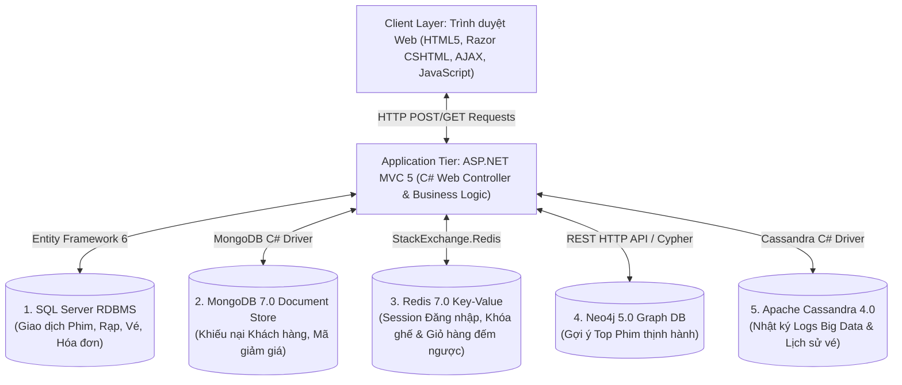

---

## CHƯƠNG 2: THIẾT KẾ CSDL QUAN HỆ SQL SERVER VÀ TÍCH HỢP NOSQL (RDBMS CORE & NOSQL INTEGRATION)

### 2.1 Vai trò Nền tảng RDBMS & Điểm Tích Hợp Với 4 Hệ NoSQL
Trong mô hình kiến trúc Đa CSDL (Polyglot Persistence), SQL Server 2019 đóng vai trò là **CSDL trung tâm giao dịch tài chính (RDBMS Core)** đảm bảo tính toàn vẹn ACID cho các dữ liệu cố định, đồng thời phối hợp ăn khớp với 4 hệ NoSQL:

- **1. Tích hợp với Redis:** SQL Server quản lý danh mục `Ghe` và `SuatChieu`. Khi khách hàng đăng nhập, Redis lưu giữ Session người dùng `user_session:{userId}` (TTL 3600s). Khi chọn ghế và combo nước uống, Redis quản lý Giỏ hàng tạm thời `cart:{userId}:{suatChieuId}` và khóa ghế `seat_lock:{suatChieuId}:{gheId}` trong 5 phút. Khi thanh toán hoàn tất, dữ liệu hóa đơn chính thức được ghi về SQL Server và Redis giải phóng giỏ hàng / khóa tạm.
- **2. Tích hợp với Neo4j:** Dữ liệu Phim, Thể loại và Lịch sử đặt vé từ SQL Server được đồng bộ sang Neo4j dưới dạng các Nút `(:User)`, `(:Movie)`, `(:Genre)` và các Cung `[:BOOKED]`, `[:FAVORITED]`. Neo4j tính toán xong Top Phim sẽ trả danh sách ID về cho SQL Server để lấy ảnh Poster hiển thị lên Trang chủ.
- **3. Tích hợp với MongoDB:** SQL Server quản lý hóa đơn thanh toán. Khi áp dụng mã giảm giá từ MongoDB (`cinema_promotions`), số tiền chiết khấu `discountAmount` được trừ trực tiếp vào `TongTien` của SQL Server. Nếu xảy ra sự cố thanh toán, ticket khiếu nại của khách được lưu vào MongoDB Collection `customer_feedbacks`.
- **4. Tích hợp với Cassandra:** Sau khi mỗi đơn đặt vé hoàn tất lưu vào SQL Server, hệ thống tự động ghi bất đồng bộ (Async Write) dữ liệu lịch sử đặt vé sang Cassandra `user_ticket_history` để phục vụ tra cứu Big Data tốc độ cao.

### 2.2 Các Thực thể Cốt lõi SQL Server:
- `NguoiDung` (`UserID`, `TenDangNhap`, `MatKhau`, `Email`, `GroupID`)
- `Phim` (`PhimID`, `TenPhim`, `Poster`, `ThoiLuong`, `MoTa`)
- `Rap` (`RapID`, `TenRap`, `DiaChi`) - `PhongChieu` (`PhongID`, `TenPhong`, `RapID`)
- `SuatChieu` (`SuatChieuID`, `PhimID`, `PhongID`, `NgayChieu`, `GioChieu`, `GiaVe`)
- `Ghe` (`GheID`, `PhongID`, `TenGhe`, `LoaiGhe`)
- `HoaDon` (`HoaDonID`, `UserID`, `NgayDat`, `TongTien`, `TrangThai`) - `Ve` (`VeID`, `SuatChieuID`, `GheID`, `HoaDonID`)

### 2.3 Sơ đồ Quan hệ Thực thể SQL Server (ERD Diagram):

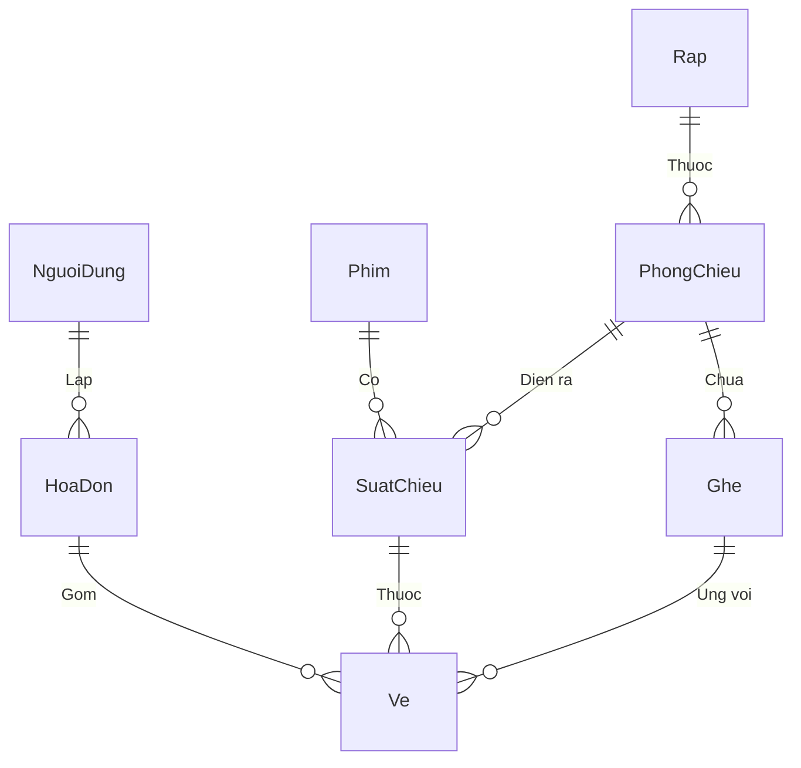

---

## CHƯƠNG 3: THIẾT KẾ CSDL NOSQL MONGODB (DOCUMENT STORE DESIGN)

### 3.1 Phạm vi nhiệm vụ & Database Name
- **Database Name:** `CinemaNoSQL`
- **Nhiệm vụ:** Lưu trữ dữ liệu tài liệu bán cấu trúc (Semi-structured Document Data), hỗ trợ mảng lồng động (Embedded Array) cho phản hồi giao tiếp giữa Admin và Khách hàng, quản lý danh mục mã Voucher ưu đãi và thực thi Aggregation thống kê báo cáo sự cố.

### 3.2 Cấu trúc Collection 1: `customer_feedbacks` (Trung tâm Khiếu nại Hỗ trợ)
Lưu trữ ticket sự cố với mảng lồng `conversations` (Embedded Document Array) ghi nhận lịch sử phản hồi thời gian thực.

```json
{
  "_id": { "$oid": "6a71eaa38676d746beb73484" },
  "userId": 7,
  "username": "huy",
  "email": "huy@gmail.com",
  "category": "Thanh toán",
  "subject": "Bị trừ tiền tài khoản Momo nhưng chưa nhận được mã vé QR",
  "content": "Tôi vừa thanh toán 180.000đ lúc 10h15 qua ví Momo, tiền đã trừ nhưng chưa có vé.",
  "imageUrls": ["/uploads/momo_bill_001.png"],
  "status": "Resolved",
  "conversations": [
    {
      "sender": "Admin",
      "message": "Chào bạn, Ban quản trị đã kiểm tra và hoàn tiền 180.000đ về ví Momo thành công!",
      "createdAt": { "$date": "2026-08-01T10:45:00.000Z" }
    }
  ],
  "createdAt": { "$date": "2026-08-01T10:20:00.000Z" }
}
```

### 3.3 Cấu trúc Collection 2: `cinema_promotions` (Kho Mã Giảm Giá Voucher)
Lưu trữ danh sách các chương trình khuyến mãi ưu đãi đặt vé.

```json
{
  "_id": { "$oid": "6a71eaa38676d746beb73499" },
  "code": "MOVANA50K",
  "title": "Giảm ngay 50.000đ cho đơn hàng từ 150.000đ",
  "discountAmount": 50000,
  "quantity": 100,
  "claimedCount": 45,
  "status": "Active",
  "startDate": { "$date": "2026-08-01T00:00:00.000Z" },
  "endDate": { "$date": "2026-08-31T23:59:59.000Z" }
}
```

### 3.4 Thiết lập Chỉ Mục (Indexing) Tối Ưu Truy Vấn MongoDB:
```javascript
// Chỉ mục tìm kiếm theo tài khoản Khách hàng
db.customer_feedbacks.createIndex({ "username": 1 });

// Chỉ mục tìm kiếm theo Trạng thái Ticket
db.customer_feedbacks.createIndex({ "status": 1 });

// Chỉ mục duy nhất (Unique Index) mã Voucher Khuyến mãi
db.cinema_promotions.createIndex({ "code": 1 }, { unique: true });
```

### 3.5 Bộ Thao Tác Lệnh Mongo Shell CRUD & Aggregation Pipeline:
```javascript
// 1. Create - Gửi khiếu nại mới
db.customer_feedbacks.insertOne({
  "userId": 7, "username": "huy", "email": "huy@gmail.com",
  "category": "Thanh toán", "subject": "Sự cố giao dịch Momo",
  "content": "Đã trừ tiền nhưng chưa nhận mã vé", "status": "New",
  "conversations": [], "createdAt": new Date()
});

// 2. Read - Xem lịch sử ticket của tài khoản
db.customer_feedbacks.find({ "username": "huy" }).sort({ "createdAt": -1 });

// 3. Update - Admin trả lời ticket và đổi trạng thái sang Resolved
db.customer_feedbacks.updateOne(
  { "_id": ObjectId("6a71eaa38676d746beb73484") },
  {
    $push: { "conversations": { "sender": "Admin", "message": "Đã xử lý xong", "createdAt": new Date() } },
    $set: { "status": "Resolved" }
  }
);

// 4. Aggregation Pipeline - Thống kê số lượng ticket theo Chuyên mục
db.customer_feedbacks.aggregate([
  {
    $group: {
      _id: "$category",
      totalTickets: { $sum: 1 },
      resolvedCount: { $sum: { $cond: [{ $eq: ["$status", "Resolved"] }, 1, 0] } },
      pendingCount: { $sum: { $cond: [{ $ne: ["$status", "Resolved"] }, 1, 0] } }
    }
  },
  { $project: { _id: 0, category: "$_id", totalTickets: 1, resolvedCount: 1, pendingCount: 1 } }
]);
```

### 3.6 Mã C# Tương Tác MongoDB Driver (`MgdbService.cs`):
```csharp
// Đẩy câu trả lời Admin vào mảng lồng conversations
var filter = Builders<CustomerFeedbackDoc>.Filter.Eq(x => x.Id, ticketId);
var update = Builders<CustomerFeedbackDoc>.Update
    .Push(x => x.Conversations, new ConversationItem { Sender = "Admin", Message = replyMsg, CreatedAt = DateTime.Now })
    .Set(x => x.Status, "Resolved");
FeedbacksCollection.UpdateOne(filter, update);
```

---

## CHƯƠNG 4: THIẾT KẾ CSDL NOSQL REDIS (KEY-VALUE STORE DESIGN)

### 4.1 Phạm vi nhiệm vụ & Cơ chế TTL In-Memory
- **Loại CSDL:** Key-Value In-Memory Store (Redis Server 7.0).
- **Phạm vi nhiệm vụ:**
  1. **Quản lý Session Đăng Nhập (User Session Store):** Lưu phiên đăng nhập người dùng với TTL = `3600` giây (1 giờ), giúp xác thực truy cập siêu tốc mà không cần query lại SQL Server.
  2. **Quản lý Giỏ Hàng Chọn Vé (Realtime Cart Reservation):** Lưu tạm thời các ghế và combo nước uống đang chọn trong Giỏ hàng với TTL = `300` giây (5 phút).
  3. **Khóa Tạm Giữ Ghế Thời Gian Thực (Realtime Seat Locking):** Tạm giữ ghế ngồi tránh xung đột đụng độ 2 người mua cùng 1 ghế với TTL = `300` giây (5 phút).

### 4.2 Cấu trúc Key Patterns & Kiểu Dữ Liệu Redis:

| STT | Chức Năng Nghiệp Vụ | Cấu Trúc Key Pattern | Kiểu Dữ Liệu | Giá Trị (Value) Sample | Thời Gian Tồn Tại (TTL) |
|---|---|---|---|---|---|
| **1** | Session Đăng Nhập | `user_session:{UserID}` | `String` (JSON) | `{"userId":7,"username":"huy","email":"huy@gmail.com","role":"Customer"}` | `3600`s (1 Giờ) |
| **2** | Giỏ Hàng Đặt Vé | `cart:{UserID}:{SuatChieuID}` | `Set` / `Hash` | `["A1", "A2", "ComboPopcornVIP"]` | `300`s (5 Phút) |
| **3** | Khóa Tạm Giữ Ghế | `seat_lock:{SuatChieuID}:{GheID}` | `String` | `UserID:7` | `300`s (5 Phút) |

### 4.3 Bộ Lệnh Redis Shell Command Đầy Đủ:
```redis
# ==========================================
# 1. PHÂN HỆ SESSION ĐĂNG NHẬP (USER SESSION)
# ==========================================
# Khởi tạo Session đăng nhập lưu trữ thông tin User trong Redis 1 giờ (3600s)
SET user_session:7 "{\"userId\":7,\"username\":\"huy\",\"role\":\"Customer\"}" EX 3600

# Kiểm tra thông tin Session khi người dùng chuyển trang
GET user_session:7

# Đăng xuất: Xóa Session đăng nhập khỏi Redis
DEL user_session:7

# ==========================================
# 2. PHÂN HỆ GIỎ HÀNG CHỌN VÉ (REALTIME CART FLOW)
# ==========================================
# Thêm ghế A1 và A2 vào Giỏ hàng đặt vé suất chiếu 101 của khách hàng User 7
SADD cart:7:101 "A1" "A2"
EXPIRE cart:7:101 300

# Lấy danh sách toàn bộ items ghế có trong giỏ hàng hiện tại
SMEMBERS cart:7:101

# Xóa giỏ hàng khi người dùng hủy hoặc thanh toán thành công
DEL cart:7:101

# ==========================================
# 3. PHÂN HỆ KHÓA TẠM GIỮ GHẾ (REALTIME SEAT LOCK)
# ==========================================
# Đặt khóa giữ ghế A1 suất 101 trong 5 phút (NX: chỉ khóa khi ghế còn trống)
SET seat_lock:101:A1 "UserID:7" NX EX 300
EXISTS seat_lock:101:A1
TTL seat_lock:101:A1
DEL seat_lock:101:A1
```

### 4.4 Mã Lệnh C# StackExchange.Redis Integration (`RedisManager.cs`):
```csharp
// 1. Quản lý Session Đăng Nhập
public bool SaveUserSession(int userId, object userSessionData) {
    string key = $"user_session:{userId}";
    string jsonValue = JsonConvert.SerializeObject(userSessionData);
    return redisDb.StringSet(key, jsonValue, TimeSpan.FromHours(1));
}

// 2. Quản lý Giỏ Hàng Đặt Vé
public bool AddToCart(int userId, int suatChieuId, string seatName) {
    string key = $"cart:{userId}:{suatChieuId}";
    bool added = redisDb.SetAdd(key, seatName);
    redisDb.KeyExpire(key, TimeSpan.FromMinutes(5));
    return added;
}

// 3. Quản lý Khóa Giữ Ghế 5 Phút
public bool LockSeat(int suatChieuId, int gheId, int userId) {
    string key = $"seat_lock:{suatChieuId}:{gheId}";
    string val = $"UserID:{userId}";
    return redisDb.StringSet(key, val, TimeSpan.FromMinutes(5), When.NotExists);
}
```

---

## CHƯƠNG 5: THIẾT KẾ CSDL NOSQL NEO4J (GRAPH DATABASE DESIGN)

### 5.1 Phạm vi nhiệm vụ & Mô hình Đồ thị
- **Loại CSDL:** Graph Database (Neo4j 5.0).
- **Nhiệm vụ:** Lưu trữ mạng lưới mối quan hệ người dùng, bộ phim và thể loại để tính toán Bảng xếp hạng gợi ý Top Phim Thịnh Hành & Thống kê độ phổ biến.

### 5.2 Sơ đồ Đồ thị Đầy Đủ (Graph Model Schema):

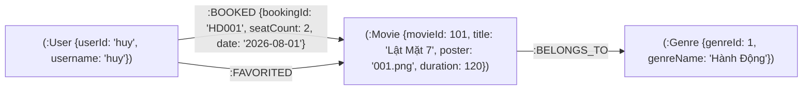

### 5.3 Bộ Câu Lệnh Cypher Query Shell Chi Tiết:
```cypher
// 1. Khởi tạo Node và Mối quan hệ mẫu
MERGE (u:User { userId: 'huy' }) SET u.username = 'Huy Vu'
MERGE (m:Movie { movieId: 101 }) SET m.title = 'Lật Mặt 7', m.poster = 'poster01.jpg'
MERGE (g:Genre { genreId: 1 }) SET g.genreName = 'Hành Động'
MERGE (m)-[:BELONGS_TO]->(g);

// 2. Truy vấn Top Phim Được Đặt Vé Nhiều Nhất
MATCH (u:User)-[r:BOOKED]->(m:Movie)
RETURN m.movieId AS MovieId, m.title AS Title, COUNT(r) AS TotalBookings
ORDER BY TotalBookings DESC LIMIT 4;

// 3. Truy vấn Top Phim Được Yêu Thích Nhất
MATCH (u:User)-[r:FAVORITED]->(m:Movie)
RETURN m.movieId AS MovieId, m.title AS Title, COUNT(r) AS TotalFavorites
ORDER BY TotalFavorites DESC LIMIT 4;

// 4. Thả Tim Yêu Thích Phim Realtime (Tạo mới hoặc Xóa mối quan hệ)
MATCH (u:User { userId: 'huy' }), (m:Movie { movieId: 101 })
MERGE (u)-[r:FAVORITED]->(m);

// 5. Thống Kê Phân Tích Độ Phổ Biến Theo Thể Loại Phim Đồ Thị
MATCH (m:Movie)-[:BELONGS_TO]->(g:Genre)
OPTIONAL MATCH (u:User)-[b:BOOKED]->(m)
OPTIONAL MATCH (u2:User)-[f:FAVORITED]->(m)
RETURN g.genreId AS GenreId, g.genreName AS GenreName, 
       COUNT(DISTINCT b) AS TotalBookings, COUNT(DISTINCT f) AS TotalFavorites
ORDER BY TotalBookings DESC;
```

### 5.4 Mã C# Neo4j REST API Client (`Neo4jService.cs`):
```csharp
// Gửi câu lệnh Cypher tới Neo4j HTTP REST Endpoint
public JObject ExecuteCypher(string cypherQuery, Dictionary<string, object> parameters = null) {
    var request = (HttpWebRequest)WebRequest.Create("http://localhost:7474/db/data/transaction/commit");
    request.Method = "POST";
    request.ContentType = "application/json";
    string authInfo = Convert.ToBase64String(Encoding.UTF8.GetBytes("neo4j:adminpassword"));
    request.Headers["Authorization"] = "Basic " + authInfo;
    // ... Serialize Payload & Return JObject
}
```

---

## CHƯƠNG 6: THIẾT KẾ CSDL NOSQL APACHE CASSANDRA (WIDE-COLUMN STORE DESIGN)

### 6.1 Phạm vi nhiệm vụ & Keyspace Architecture
- **Loại CSDL:** Wide-Column Distributed Store (Apache Cassandra 4.0).
- **Keyspace Name:** `cinemadb_analytics`
- **Replication Strategy:** `SimpleStrategy`, `replication_factor: 1`.
- **Nhiệm vụ:** Lưu vết nhật ký hoạt động Big Data (User Activity Logs) và lịch sử vé đặt với tốc độ ghi cực nhanh (High Write Throughput).

### 6.2 Cấu trúc Các Bảng CQL (Wide-Column Tables):

#### Bảng 1: `user_activity_logs` (Nhật ký hoạt động)
- **Partition Key:** `user_id`
- **Clustering Key:** `activity_time DESC`
```sql
CREATE TABLE cinemadb_analytics.user_activity_logs (
    user_id int,
    activity_time timestamp,
    log_id uuid,
    activity_type text,
    description text,
    ip_address text,
    device_info text,
    PRIMARY KEY (user_id, activity_time)
) WITH CLUSTERING ORDER BY (activity_time DESC);
```

#### Bảng 2: `user_ticket_history` (Lịch sử đặt vé)
- **Partition Key:** `user_id`
- **Clustering Key:** `booking_time DESC`
```sql
CREATE TABLE cinemadb_analytics.user_ticket_history (
    user_id int,
    booking_time timestamp,
    booking_id uuid,
    movie_title text,
    seat_names list<text>,
    total_amount decimal,
    payment_method text,
    status text,
    PRIMARY KEY (user_id, booking_time)
) WITH CLUSTERING ORDER BY (booking_time DESC);
```

#### Bảng 3: `seat_status_history` (Nhật ký biến động trạng thái ghế)
- **Partition Key:** `showtime_id`
- **Clustering Key:** `status_time DESC`
```sql
CREATE TABLE cinemadb_analytics.seat_status_history (
    showtime_id int,
    status_time timestamp,
    seat_id int,
    seat_name text,
    status text,
    user_id int,
    PRIMARY KEY (showtime_id, status_time)
) WITH CLUSTERING ORDER BY (status_time DESC);
```

### 6.3 Bộ Lệnh Truy Vấn CQL Shell:
```sql
-- 1. Ghi nhận Nhật ký hoạt động đăng nhập của người dùng
INSERT INTO cinemadb_analytics.user_activity_logs (user_id, activity_time, log_id, activity_type, description, ip_address, device_info)
VALUES (7, toTimestamp(now()), uuid(), 'LOGIN', 'Đăng nhập hệ thống thành công', '192.168.1.10', 'Chrome Windows 11');

-- 2. Truy vấn Lịch sử đặt vé của người dùng (Tự động sắp xếp thời gian mới nhất lên đầu)
SELECT * FROM cinemadb_analytics.user_ticket_history WHERE user_id = 7;
```

### 6.4 Mã C# Cassandra C# Driver Integration (`CassandraService.cs`):
```csharp
// Ghi nhận nhật ký bất đồng bộ (High Speed Write)
public async Task LogUserActivityAsync(int userId, string activityType, string description) {
    var statement = new SimpleStatement(
        "INSERT INTO cinemadb_analytics.user_activity_logs (user_id, activity_time, log_id, activity_type, description) VALUES (?, ?, ?, ?, ?)",
        userId, DateTimeOffset.UtcNow, Guid.NewGuid(), activityType, description
    );
    await session.ExecuteAsync(statement);
}
```

---

## CHƯƠNG 7: THIẾT KẾ MÔ ĐUN XỬ LÝ VÀ SƠ ĐỒ LỚP (CLASS DIAGRAM)

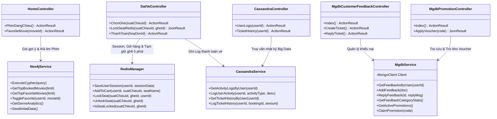

---

## CHƯƠNG 8: QUY TRÌNH LUỒNG NGHIỆP VỤ HỆ THỐNG (SYSTEM SEQUENCE DIAGRAMS)

### 8.1 Phân hệ CSDL Redis (Key-Value Store)

#### 8.1.1 Luồng Đăng Nhập & Khởi Tạo Active Session Trong Redis (TTL 1 Giờ)

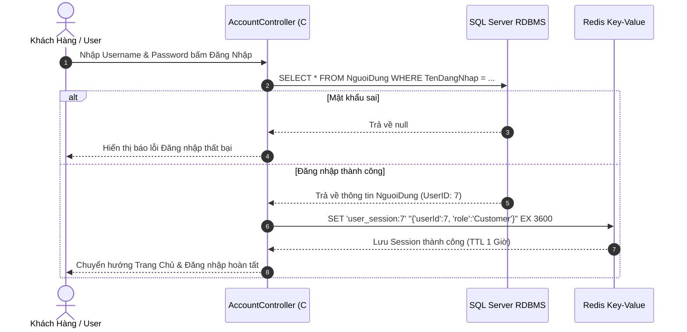

#### 8.1.2 Luồng Quản Lý Giỏ Hàng Chọn Vé & Khóa Ghế Đếm Ngược Realtime (TTL 5 Phút)

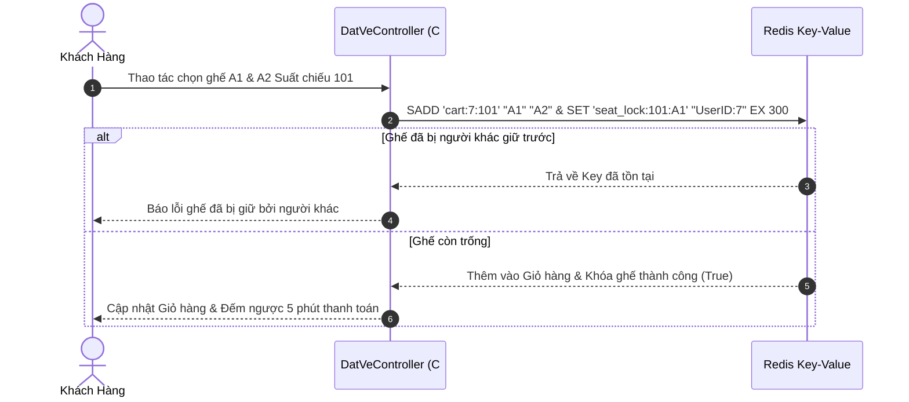

#### 8.1.3 Luồng Giải Phóng Khóa Giữ Ghế / Giỏ Hàng Khi Hủy Hoặc Thanh Toán Hoàn Tất (Redis Key Delete)

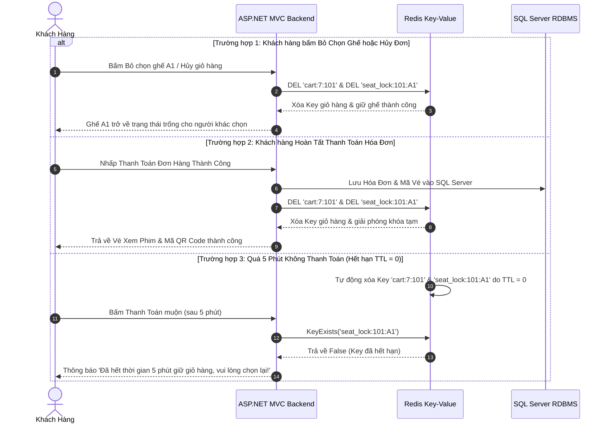

---

### 8.2 Phân hệ CSDL Neo4j (Graph Database)

#### 8.2.1 Luồng Gợi Ý Top Phim Thịnh Hành Trên Trang Chủ (Neo4j Graph DB + HttpRuntime.Cache)

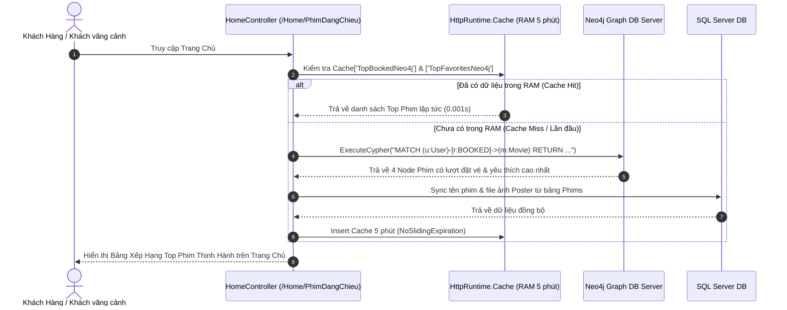

#### 8.2.2 Luồng Khách Hàng Thả Tim Yêu Thích Phim Realtime (Relationship [:FAVORITED])

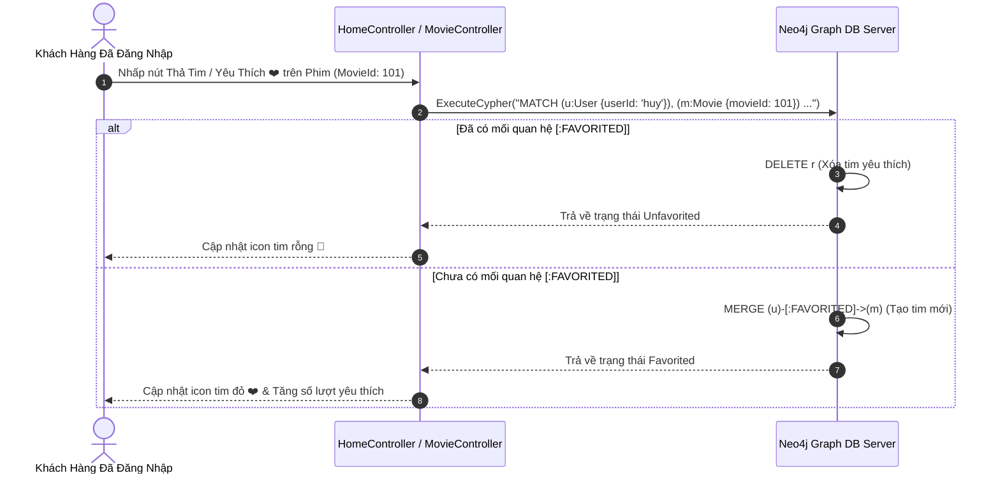

#### 8.2.3 Luồng Thống Kê Phân Tích Độ Phổ Biến Theo Thể Loại Phim Đồ Thị (GetGenreAnalytics)

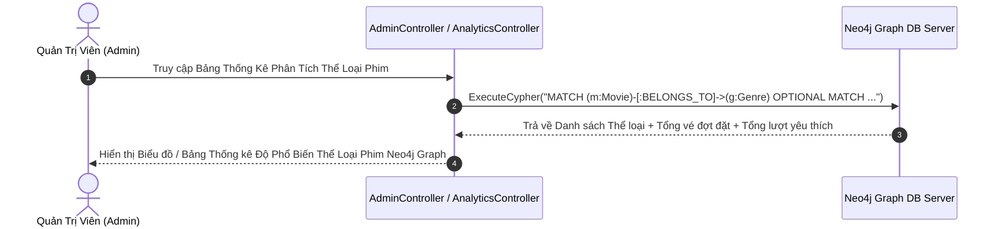

---

### 8.3 Phân hệ CSDL MongoDB (Document Store)

#### 8.3.1 Luồng Tiếp Nhận Khiếu Nại & Trả Lời Của Admin (Collection 'customer_feedbacks')

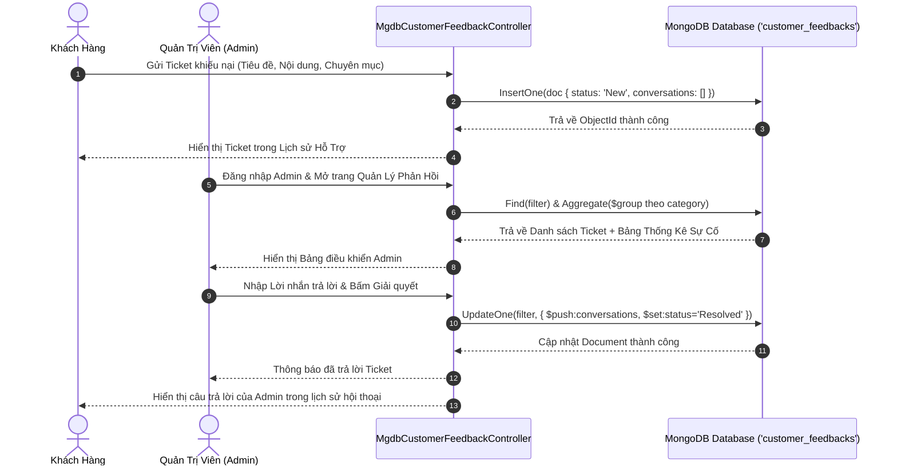

#### 8.3.2 Luồng Áp Dụng Mã Khuyến Mãi & Voucher Giảm Giá (Collection 'cinema_promotions')

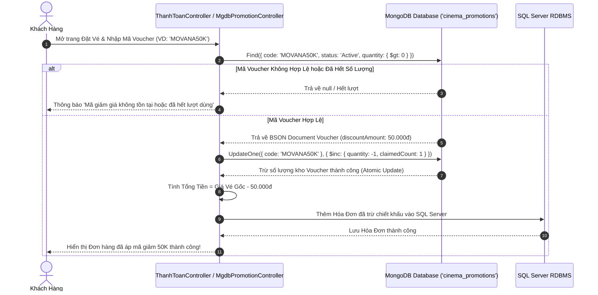

---

### 8.4 Phân hệ CSDL Apache Cassandra (Wide-Column Store)

#### 8.4.1 Luồng Ghi Nhật Ký Hoạt Động Big Data & Lịch Sử Vé (Keyspace 'cinemadb_analytics')

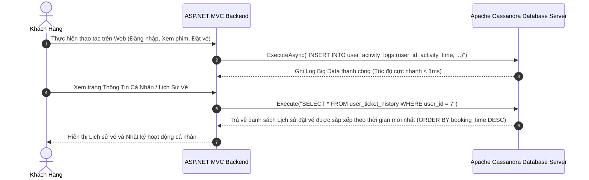

---

### 📌 TỔNG KẾT TÀI LIỆU SDS TỔNG THỂ V3.0
Tài liệu SDS v3.0 này cung cấp trọn vẹn 100% thiết kế kỹ thuật của cả **SQL Server và 4 hệ NoSQL (MongoDB, Redis, Neo4j, Cassandra)**, hoàn chỉnh theo chuẩn đồ án cấp trường và tài liệu thiết kế hệ thống lớn.
