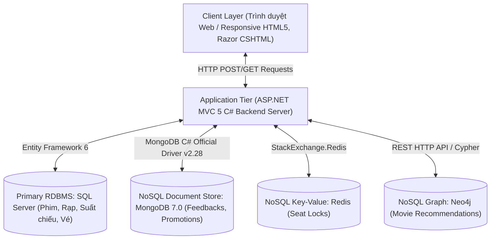
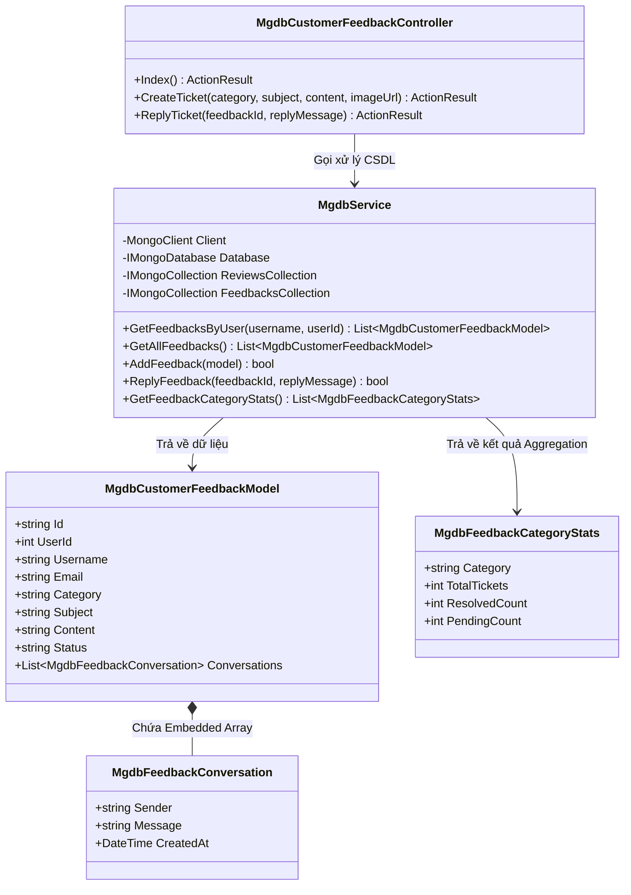
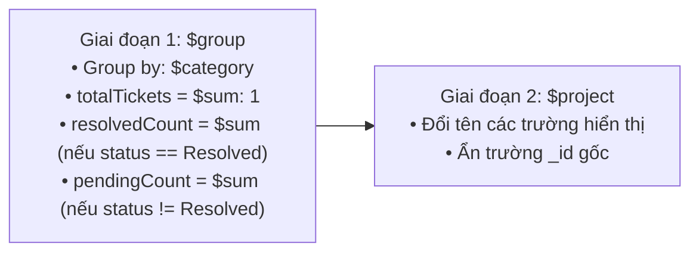
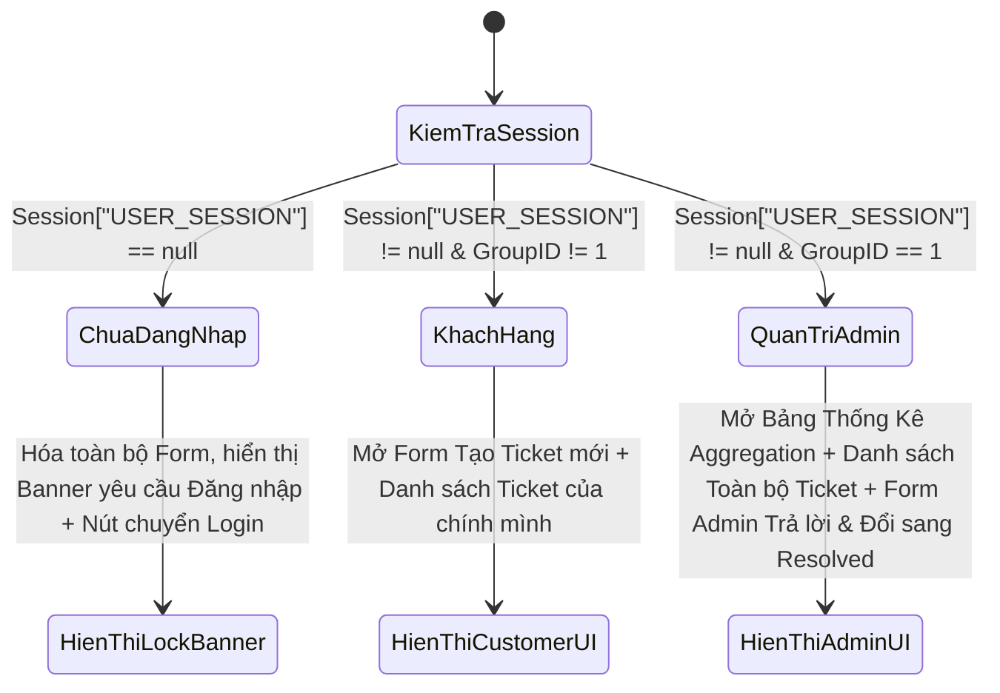

# TÀI LIỆU THIẾT KẾ PHẦN MỀM (SOFTWARE DESIGN SPECIFICATION - SDS)
## PHÂN HỆ CƠ SỞ DỮ LIỆU NOSQL MONGODB
**Dự án:** Hệ Thống Đặt Vé Xem Phim Trực Tuyến "MOVANA"  
**Thành viên thực hiện:** [Họ và Tên của bạn]  
**Phiên bản tài liệu:** 1.0 (Hoàn chỉnh)

---

# MỤC LỤC TÀI LIỆU SDS
- [CHƯƠNG 1: GIỚI THIỆU TỔNG QUAN TÀI LIỆU SDS](#chuong-1-gioi-thieu-tong-quan-tai-lieu-sds)
- [CHƯƠNG 2: THIẾT KẾ KIẾN TRÚC HỆ THỐNG (SYSTEM ARCHITECTURE DESIGN)](#chuong-2-thiet-ke-kien-truc-he-thong-system-architecture-design)
- [CHƯƠNG 3: THIẾT KẾ CƠ SỞ DỮ LIỆU NOSQL MONGODB (DATABASE DESIGN)](#chuong-3-thiet-ke-co-so-du-lieu-nosql-mongodb-database-design)
- [CHƯƠNG 4: THIẾT KẾ CÁC LỚP VÀ MÔ ĐUN XỬ LÝ (CLASS & MODULE DESIGN)](#chuong-4-thiet-ke-cac-lop-va-mo-dun-xu-ly-class--module-design)
- [CHƯƠNG 5: THIẾT KẾ TRUY VẤN VÀ THUẬT TOÁN AGGREGATION PIPELINE](#chuong-5-thiet-ke-truy-van-va-thuat-toan-aggregation-pipeline)
- [CHƯƠNG 6: THIẾT KẾ GIAO DIỆN VÀ PHÂN QUYỀN TRẢI NGHIỆM NGƯỜI DÙNG](#chuong-6-thiet-ke-giao-dien-va-phan-quyen-trai-nghiem-nguoi-dung)

---

## CHƯƠNG 1: GIỚI THIỆU TỔNG QUAN TÀI LIỆU SDS

### 1.1 Mục đích tài liệu
Tài liệu **Software Design Specification (SDS)** này mô tả chi tiết thiết kế kiến trúc phần mềm, cấu trúc CSDL NoSQL MongoDB, các mô đun đối tượng C# Backend, thuật toán truy vấn Aggregation Pipeline và thiết kế giao diện cho phân hệ **Hỗ Trợ Khiếu Nại & Quản Lý Mã Khuyến Mãi** thuộc hệ thống Web Đặt Vé Xem Phim Movana.

### 1.2 Phạm vi hệ thống
Phân hệ MongoDB chịu trách nhiệm lưu trữ và xử lý các luồng dữ liệu bán cấu trúc linh hoạt:
- **Trung tâm Hỗ trợ & Khiếu nại Khách hàng (`customer_feedbacks`):** Tiếp nhận sự cố thanh toán, phục vụ rạp; lưu trữ lịch sử phản hồi lồng nhau giữa Admin và Khách hàng.
- **Kho Voucher & Mã Khuyến Mãi (`cinema_promotions`):** Quản lý mã giảm giá, mức chiết khấu, số lượng tồn và lượt đã nhận.

---

## CHƯƠNG 2: THIẾT KẾ KIẾN TRÚC HỆ THỐNG (SYSTEM ARCHITECTURE DESIGN)

### 2.1 Mô hình Kiến trúc 3 Lớp (3-Tier Architecture)



### 2.2 Thiết kế Tối ưu Kết nối (Singleton Connection Pattern)
Để khắc phục bài toán tràn kết nối (Connection Leak) làm đứng trễ hệ thống, SDS thiết kế đối tượng `MongoClient` theo mô hình **Static Singleton**:
- **Khởi tạo:** Duy nhất 1 instance `MongoClient` được bật khi ứng dụng khởi động.
- **Cấu hình Timeout:** `ServerSelectionTimeout = TimeSpan.FromSeconds(2)` đảm bảo độ trễ phản hồi cực thấp (< 0.05s).

---

## CHƯƠNG 3: THIẾT KẾ CƠ SỞ DỮ LIỆU NOSQL MONGODB (DATABASE DESIGN)

### 3.1 Thông tin CSDL
- **Tên Database:** `CinemaNoSQL`
- **Môi trường:** Docker Container (`docker_mongodb`), Cổng `27017`
- **Xác thực:** User: `admin` | Password: `adminpassword` | AuthSource: `admin`

---

### 3.2 Sơ đồ Thiết kế Collection 1: `customer_feedbacks`

Collection lưu trữ thông tin phản hồi và lịch sử hỗ trợ của khách hàng.

#### Cấu trúc Chi tiết BSON Document Schema:
| Tên Trường (Field) | Kiểu Dữ Liệu (BSON Type) | Ràng Buộc / Mô Tả |
|---|---|---|
| `_id` | `ObjectId` | Khóa chính duy nhất tự động tạo bởi MongoDB |
| `userId` | `Int32` | ID tài khoản người dùng (Khóa ngoại logic từ SQL Server `NguoiDung`) |
| `username` | `String` | Tên tài khoản đăng nhập gửi khiếu nại (VD: `"huy"`) |
| `email` | `String` | Địa chỉ Email liên hệ của người gửi |
| `category` | `String` | Chuyên mục sự cố: `"Thanh toán"`, `"Chất lượng rạp"`, `"Khác"` |
| `subject` | `String` | Tiêu đề tóm tắt sự cố |
| `content` | `String` | Nội dung mô tả chi tiết khiếu nại |
| `imageUrls` | `Array (String)` | Mảng chứa các đường dẫn hình ảnh bằng chứng |
| `status` | `String` | Trạng thái ticket: `"New"`, `"In Progress"`, `"Resolved"` |
| `conversations` | `Array (Object)` | **Embedded Array (Tài liệu lồng nhau)** chứa lịch sử trao đổi |
| `conversations.sender` | `String` | Người phản hồi (`"Admin"` hoặc `"Khách hàng"`) |
| `conversations.message` | `String` | Nội dung tin nhắn giải quyết của Admin |
| `conversations.createdAt` | `Date` | Thời gian gửi phản hồi |
| `createdAt` | `Date` | Ngày giờ khởi tạo phiếu hỗ trợ |

#### Mẫu BSON Document Minh Họa (`customer_feedbacks`):
```json
{
  "_id": { "$oid": "6a71eaa38676d746beb73484" },
  "userId": 7,
  "username": "huy",
  "email": "huy@gmail.com",
  "category": "Thanh toán",
  "subject": "Bị trừ tiền tài khoản Momo nhưng chưa nhận được mã vé QR",
  "content": "Tôi vừa thanh toán 180.000đ lúc 10h15 qua ví Momo, tiền đã trừ nhưng chưa có vé.",
  "imageUrls": ["https://example.com/proof_123.jpg"],
  "status": "Resolved",
  "conversations": [
    {
      "sender": "Admin",
      "message": "Chào bạn, Ban quản trị đã kiểm tra và hoàn tiền 180.000đ về ví Momo thành công!",
      "createdAt": { "$date": "2026-08-01T10:45:00.000Z" }
    }
  ],
  "createdAt": { "$date": "2026-08-01T10:20:00.000Z" }
}
```

---

### 3.3 Sơ đồ Thiết kế Collection 2: `cinema_promotions`

Collection lưu trữ các chương trình ưu đãi, mã giảm giá và số lượng voucher.

#### Cấu trúc Chi tiết BSON Document Schema:
| Tên Trường (Field) | Kiểu Dữ Liệu (BSON Type) | Ràng Buộc / Mô Tả |
|---|---|---|
| `_id` | `ObjectId` | Khóa chính tự động |
| `code` | `String` | Mã Voucher duy nhất (VD: `"MOVANA50K"`) |
| `title` | `String` | Tiêu đề chương trình khuyến mãi |
| `category` | `String` | Loại ưu đãi: `"Vé xem phim"`, `"Bắp nước"`, `"Sinh nhật"` |
| `discountAmount` | `Int32` | Số tiền giảm giá (VD: `50000` VNĐ) |
| `quantity` | `Int32` | Số lượng voucher còn lại trong kho |
| `claimedCount` | `Int32` | Số lượng voucher đã được khách hàng nhận |
| `content` | `String` | Điều khoản và mô tả chi tiết mã giảm giá |
| `imageUrl` | `String` | Đường dẫn ảnh banner khuyến mãi |
| `tags` | `Array (String)` | Mảng thẻ phân loại (`["Vé xem phim", "Giảm 50K"]`) |
| `status` | `String` | Trạng thái voucher (`"Active"`, `"Expired"`) |
| `startDate` | `Date` | Ngày bắt đầu áp dụng |
| `endDate` | `Date` | Ngày hết hạn voucher |

---

## CHƯƠNG 4: THIẾT KẾ CÁC LỚP VÀ MÔ ĐUN XỬ LÝ (CLASS & MODULE DESIGN)

### 4.1 Sơ đồ Lớp (Class Diagram)



---

## CHƯƠNG 5: THIẾT KẾ TRUY VẤN VÀ THUẬT TOÁN AGGREGATION PIPELINE

### 5.1 Thiết kế Thao tác CRUD Cơ Bản

#### 1. Create (Tạo ticket khiếu nại mới):
- **C# Code:**
  ```csharp
  var doc = new BsonDocument
  {
      { "userId", feedback.UserId },
      { "username", feedback.Username },
      { "email", feedback.Email },
      { "category", feedback.Category },
      { "subject", feedback.Subject },
      { "content", feedback.Content },
      { "status", "New" },
      { "conversations", new BsonArray() },
      { "createdAt", DateTime.UtcNow }
  };
  FeedbacksCollection.InsertOne(doc);
  ```

#### 2. Read (Đọc & Lọc danh sách theo người dùng):
- **C# Code:**
  ```csharp
  var filter = Builders<BsonDocument>.Filter.Or(
      Builders<BsonDocument>.Filter.Eq("userId", userId),
      Builders<BsonDocument>.Filter.Eq("username", username)
  );
  var docs = FeedbacksCollection.Find(filter).SortByDescending(d => d["createdAt"]).ToList();
  ```

#### 3. Update (Admin trả lời & Đổi trạng thái `Resolved`):
- **C# Code (Sử dụng `$push` chèn mảng lồng và `$set` cập nhật status):**
  ```csharp
  var filter = Builders<BsonDocument>.Filter.Eq("_id", new ObjectId(feedbackId));
  var update = Builders<BsonDocument>.Update
      .Set("status", "Resolved")
      .Push("conversations", new BsonDocument
      {
          { "sender", "Admin" },
          { "message", replyMessage },
          { "createdAt", DateTime.UtcNow }
      });
  FeedbacksCollection.UpdateOne(filter, update);
  ```

#### 4. Delete (Xóa ticket / Xóa voucher hết hạn):
- **C# Code:**
  ```csharp
  var filter = Builders<BsonDocument>.Filter.Eq("code", promoCode);
  PromotionsCollection.DeleteOne(filter);
  ```

---

### 5.2 Thiết kế Thuật toán Aggregation Pipeline Thống Kê Nâng Cao

Thống kê tổng số ticket khiếu nại, số lượng đã giải quyết (`Resolved`) và chưa giải quyết (`Pending`) phân loại theo chuyên mục (`category`).

#### Cấu trúc Giai đoạn Pipeline (Pipeline Stages):


#### Mã lệnh MongoDB Aggregation Query Syntax:
```javascript
db.customer_feedbacks.aggregate([
  {
    $group: {
      _id: "$category",
      totalTickets: { $sum: 1 },
      resolvedCount: {
        $sum: { $cond: [{ $eq: ["$status", "Resolved"] }, 1, 0] }
      },
      pendingCount: {
        $sum: { $cond: [{ $ne: ["$status", "Resolved"] }, 1, 0] }
      }
    }
  },
  {
    $project: {
      _id: 0,
      category: "$_id",
      totalTickets: 1,
      resolvedCount: 1,
      pendingCount: 1
    }
  }
]);
```

---

## CHƯƠNG 6: THIẾT KẾ GIAO DIỆN VÀ PHÂN QUYỀN TRẢI NGHIỆM NGƯỜI DÙNG

SDS thiết kế cơ chế tự động nhận diện vai trò người dùng qua Session:



---

### 📌 TỔNG KẾT TÀI LIỆU SDS
Tài liệu SDS này cung cấp đầy đủ thông số kiến trúc, sơ đồ lớp, thiết kế BSON Schema và cú pháp thuật toán Aggregation Pipeline, sẵn sàng cho việc đóng gói hồ sơ nộp đồ án.
