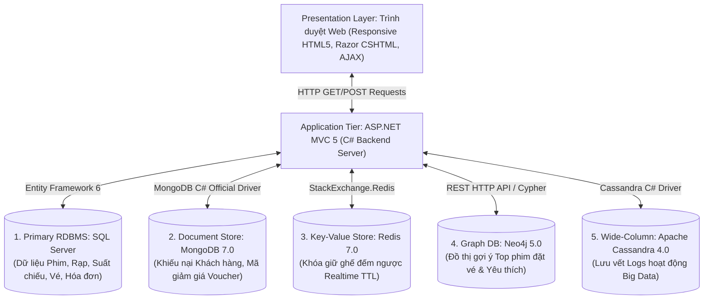
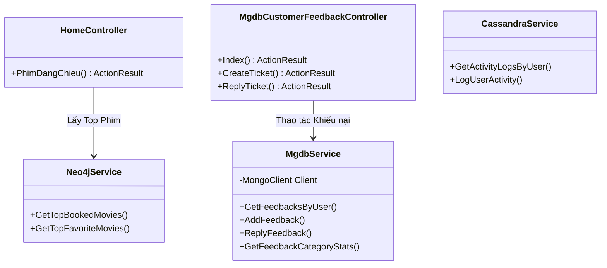
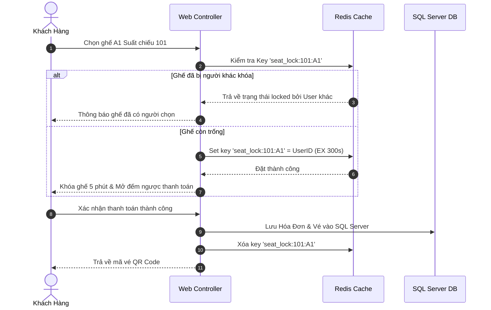

# TÀI LIỆU THIẾT KẾ PHẦN MỀM TỔNG THỂ HỆ THỐNG
## (SOFTWARE DESIGN SPECIFICATION - SDS)
**Dự án:** Hệ Thống Đặt Vé Xem Phim Trực Tuyến Đa CSDL "MOVANA CINEMA"  
**Các công nghệ CSDL:** SQL Server (RDBMS), MongoDB (Document Store), Redis (Key-Value), Neo4j (Graph), Apache Cassandra (Wide-Column Store).  
**Phiên bản tài liệu:** 2.0 (Bản Chính Thức Toàn Bộ Hệ Thống)

---

# MỤC LỤC TÀI LIỆU SDS TỔNG THỂ
- [CHƯƠNG 1: TỔNG QUAN KIẾN TRÚC HỆ THỐNG (SYSTEM ARCHITECTURE OVERVIEW)](#chuong-1-tong-quan-kien-truc-he-thong-system-architecture-overview)
- [CHƯƠNG 2: THIẾT KẾ CSDL QUAN HỆ SQL SERVER (RDBMS CORE DESIGN)](#chuong-2-thiet-ke-csdl-quan-he-sql-server-rdbms-core-design)
- [CHƯƠNG 3: THIẾT KẾ CSDL NOSQL MONGODB (DOCUMENT STORE DESIGN)](#chuong-3-thiet-ke-csdl-nosql-mongodb-document-store-design)
- [CHƯƠNG 4: THIẾT KẾ CSDL NOSQL REDIS (KEY-VALUE STORE DESIGN)](#chuong-4-thiet-ke-csdl-nosql-redis-key-value-store-design)
- [CHƯƠNG 5: THIẾT KẾ CSDL NOSQL NEO4J (GRAPH DATABASE DESIGN)](#chuong-5-thiet-ke-csdl-nosql-neo4j-graph-database-design)
- [CHƯƠNG 6: THIẾT KẾ CSDL NOSQL APACHE CASSANDRA (WIDE-COLUMN STORE DESIGN)](#chuong-6-thiet-ke-csdl-nosql-apache-cassandra-wide-column-store-design)
- [CHƯƠNG 7: THIẾT KẾ MÔ ĐUN XỬ LÝ VÀ SƠ ĐỒ LỚP (CLASS & COMPONENT DESIGN)](#chuong-7-thiet-ke-mo-dun-xu-ly-va-so-do-lop-class--component-design)
- [CHƯƠNG 8: QUY TRÌNH LUỒNG NGHIỆP VỤ HỆ THỐNG (SYSTEM SEQUENCE DIAGRAMS)](#chuong-8-quy-trinh-luong-nghiep-vu-he-thong-system-sequence-diagrams)

---

## CHƯƠNG 1: TỔNG QUAN KIẾN TRÚC HỆ THỐNG (SYSTEM ARCHITECTURE OVERVIEW)

### 1.1 Mô hình Kiến trúc Polyglot Persistence (Đa Cơ Sở Dữ Liệu)
Hệ thống Web Đặt Vé Xem Phim Movana áp dụng kiến trúc **Polyglot Persistence**, kết hợp điểm mạnh của 5 loại CSDL khác nhau để tối ưu hiệu năng tối đa:



---

## CHƯƠNG 2: THIẾT KẾ CSDL QUAN HỆ SQL SERVER (RDBMS CORE DESIGN)

### 2.1 Phạm vi nhiệm vụ SQL Server
Chịu trách nhiệm quản lý các giao dịch tài chính ACID cố định và cấu trúc rạp chiếu.

### 2.2 Sơ đồ Quan hệ Thực thể (Entity Relationship Diagram - ERD)
- **`Phim`**: `PhimID` (PK), `TenPhim`, `DaoDien`, `DienVien`, `Poster`, `NgayKhoiChieu`.
- **`Rap`**: `RapID` (PK), `TenRap`, `DiaChi`, `SoDienThoai`.
- **`PhongChieu`**: `PhongID` (PK), `TenPhong`, `RapID` (FK).
- **`SuatChieu`**: `SuatChieuID` (PK), `PhimID` (FK), `PhongID` (FK), `NgayChieu`, `GioChieu`, `GiaVe`.
- **`Ghe`**: `GheID` (PK), `PhongID` (FK), `TenGhe`, `LoaiGhe`.
- **`NguoiDung`**: `UserID` (PK), `TenDangNhap`, `MatKhau`, `HoTen`, `Email`, `SoDienThoai`, `GroupID`.
- **`HoaDon`**: `HoaDonID` (PK), `UserID` (FK), `NgayDat`, `TongTien`, `TrangThai`.
- **`Ve`**: `VeID` (PK), `SuatChieuID` (FK), `GheID` (FK), `HoaDonID` (FK), `GiaVe`.

---

## CHƯƠNG 3: THIẾT KẾ CSDL NOSQL MONGODB (DOCUMENT STORE DESIGN)

### 3.1 Phạm vi nhiệm vụ MongoDB
Lưu trữ và xử lý dữ liệu bán cấu trúc linh hoạt với độ trễ phản hồi thấp (<0.01s).

### 3.2 Sơ đồ Thiết kế BSON Collection 1: `customer_feedbacks`
- **Tên Database:** `CinemaNoSQL`
- **Mô hình:** Embedded Array `conversations` lưu lịch sử chat Admin và Khách hàng trong cùng 1 Document.

```json
{
  "_id": { "$oid": "6a71eaa38676d746beb73484" },
  "userId": 7,
  "username": "huy",
  "email": "huy@gmail.com",
  "category": "Thanh toán",
  "subject": "Bị trừ tiền tài khoản Momo nhưng chưa nhận được mã vé QR",
  "content": "Tôi vừa thanh toán 180.000đ lúc 10h15 qua ví Momo, tiền đã trừ nhưng chưa có vé.",
  "status": "Resolved",
  "conversations": [
    {
      "sender": "Admin",
      "message": "Chào bạn, Ban quản trị đã kiểm tra và hoàn tiền 180.000đ về ví Momo thành công!",
      "createdAt": { "$date": "2026-08-01T10:45:00.000Z" }
    }
  ],
  "createdAt": { "$date": "2026-08-01T10:20:00.000Z" }
}
```

### 3.3 Sơ đồ Thiết kế BSON Collection 2: `cinema_promotions`
- Lưu trữ danh sách mã giảm giá, voucher chiết khấu (`code`, `discountAmount`, `quantity`, `claimedCount`, `startDate`, `endDate`).

---

## CHƯƠNG 4: THIẾT KẾ CSDL NOSQL REDIS (KEY-VALUE STORE DESIGN)

### 4.1 Phạm vi nhiệm vụ Redis
Tạm giữ ghế ngồi đếm ngược theo thời gian thực (Realtime Seat Locking) khi khách hàng chọn ghế đặt vé.

### 4.2 Thiết kế Cấu trúc Key-Value & TTL
- **Cấu trúc Key:** `seat_lock:{SuatChieuID}:{GheID}`
- **Value:** `UserID:{UserID}` (VD: `UserID:7`)
- **Thời gian sống (TTL):** 300 giây (5 phút). Hết 5 phút ghế tự động giải phóng nếu không thanh toán.

---

## CHƯƠNG 5: THIẾT KẾ CSDL NOSQL NEO4J (GRAPH DATABASE DESIGN)

### 5.1 Phạm vi nhiệm vụ Neo4j
Xây dựng mạng đồ thị tri thức gợi ý sản phẩm (Recommendation System).

### 5.2 Mô hình Đồ thị Nodes & Relationships

```mermaid
graph LR
    User["(:User {username: 'huy'})"]
    Movie["(:Movie {movieId: 101, title: 'Lật Mặt 7'})"]
    
    User -->|:BOOKED {bookedAt: '2026-08-01'}| Movie
    User -->|:FAVORITED| Movie
```

- **Cypher Query gợi ý Top Phim Đặt Vé:**
  ```cypher
  MATCH (u:User)-[r:BOOKED]->(m:Movie)
  RETURN m.movieId AS MovieId, m.title AS Title, COUNT(r) AS TotalBookings
  ORDER BY TotalBookings DESC LIMIT 4
  ```

---

## CHƯƠNG 6: THIẾT KẾ CSDL NOSQL APACHE CASSANDRA (WIDE-COLUMN STORE DESIGN)

### 6.1 Phạm vi nhiệm vụ Cassandra
Ghi nhật ký hoạt động Big Data với tốc độ ghi nhanh (High Write Throughput).

### 6.2 Cấu trúc Bảng Keyspace `cinemadb_analytics`
- **Bảng `user_activity_logs`:**
  - Partition Key: `user_id` | Clustering Key: `activity_time` (DESC).
  - Lưu chi tiết lượt đăng nhập, bấm xem phim, tìm kiếm của người dùng.
- **Bảng `user_ticket_history`:**
  - Partition Key: `user_id` | Clustering Key: `booking_time` (DESC).
  - Lưu chi tiết lịch sử vé đã thanh toán.

---

## CHƯƠNG 7: THIẾT KẾ MÔ ĐUN XỬ LÝ VÀ SƠ ĐỒ LỚP (CLASS & COMPONENT DESIGN)



---

## CHƯƠNG 8: QUY TRÌNH LUỒNG NGHIỆP VỤ HỆ THỐNG (SYSTEM SEQUENCE DIAGRAMS)

### 8.1 Luồng Khách Hàng Đặt Vé & Tạm Giữ Ghế Realtime (Redis + SQL Server)



---

### 📌 TỔNG KẾT TÀI LIỆU SDS TỔNG THỂ
Tài liệu SDS v2.0 này cung cấp toàn bộ bức tranh kiến trúc kỹ thuật của đồ án Web Đặt Vé Xem Phim Movana, đáp ứng chuẩn mực quy mô doanh nghiệp và hồ sơ nộp bài đồ án tốt nghiệp.
